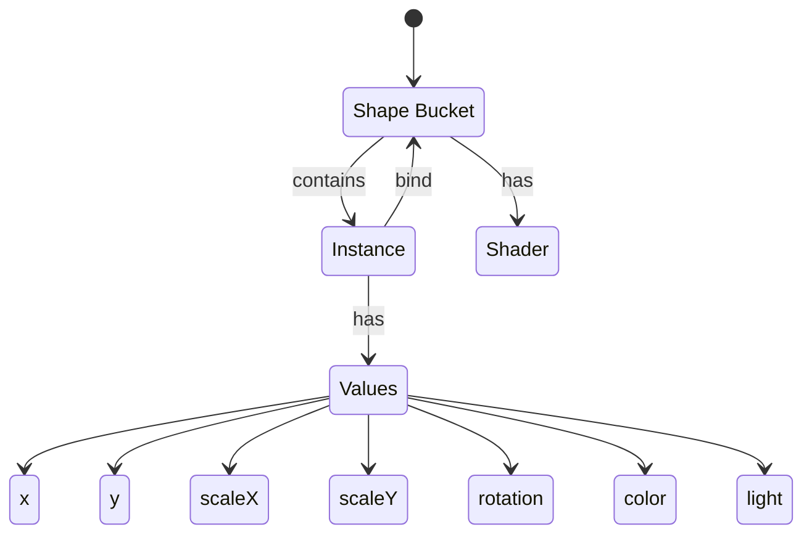
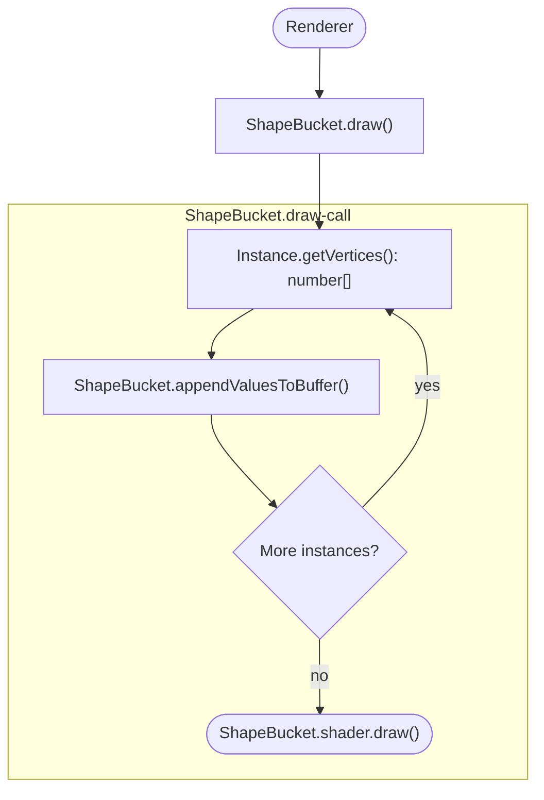
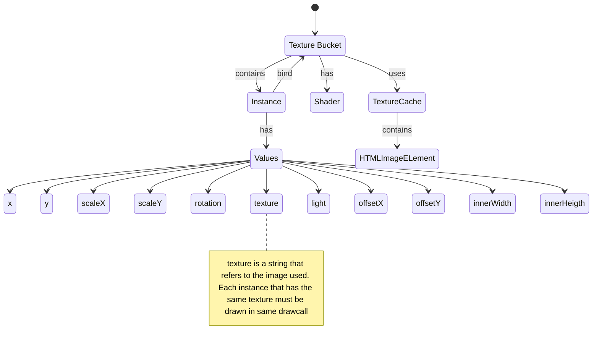

## SHAPE CLASS

### UML

```mermaid
stateDiagram
      direction TB
      [*] --> Still
      Instance --> Still:bind
      Still --> Shader:has
      Still --> Instance:contains
      Instance --> Values:has
      Values --> x
      Values --> y
      Values --> scaleX
      Values --> scaleY
      Values --> rotation
      Values --> color
      Values --> s1
      Still:Shape Bucket
      s1:light
```

### RENDERING ALGORITHM

```mermaid
flowchart TD
 subgraph s1["ShapeBucket.draw-call"]
        C["Instance.getVertices(): number[]"]
        D["ShapeBucket.appendValuesToBuffer()"]
        E{"More instances?"}
        F(["ShapeBucket.shader.draw()"])
  end
    A(["Renderer"]) --> B["ShapeBucket.draw()"]
    B --> C
    C --> D
    D --> E
    E -- yes --> C
    E -- no --> F
```

## TEXTURE CLASS

### UML

```mermaid
stateDiagram
  direction TB
  [*] --> Still
  Instance --> Still:bind
  Still --> Shader:has
  Still --> Instance:contains
  Instance --> Values:has
  Values --> x
  Values --> y
  Values --> scaleX
  Values --> scaleY
  Values --> rotation
  Values --> color
  Values --> s1
  Still --> s2:uses
  s2 --> s3:contains
  Values --> s4
  Values --> s5
  Values --> innerWidth
  Values --> innerHeigth
  Still:Texture Bucket
  color:texture
  s1:light
  s2:TextureCache
  s3:HTMLImageELement
  s4:offsetX
  s5:offsetY
  note right of color : texture is a string that refers to the image used. Each instance that has the same texture must be drawn in same drawcall
```